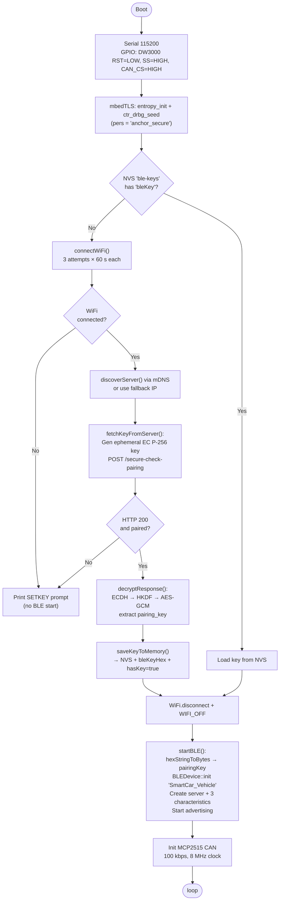
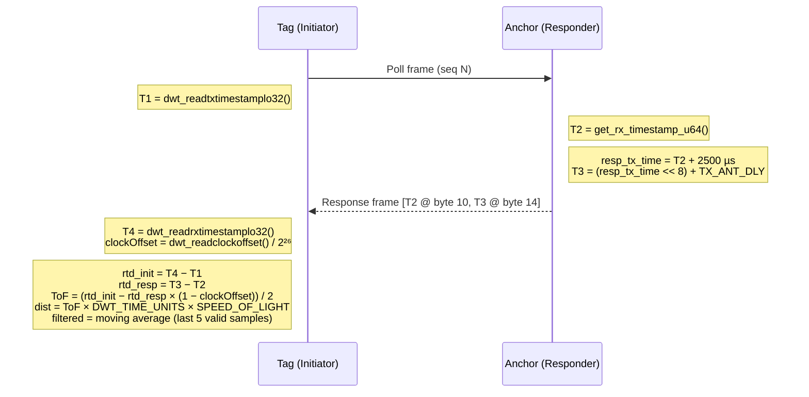
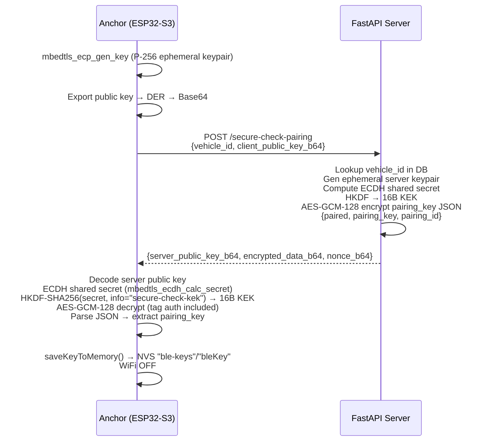

# SCA System Diagrams

Accurate Mermaid diagrams generated from the production firmware in `Src/latest/`.

---

## 1. Full System Sequence Diagram

End-to-end flow from Anchor boot through key provisioning, BLE auth, UWB ranging, and CAN commands.

```mermaid
sequenceDiagram
    participant Server as FastAPI Server
    participant Anchor as Anchor (ESP32-S3)
    participant Tag as Tag (ESP32-S3)

    Note over Anchor: Boot — NVS has no key
    Anchor->>Server: WiFi connect + mDNS discover (smartcar._http._tcp)
    Anchor->>Server: POST /secure-check-pairing<br/>{vehicle_id, client_pub_key_b64 (ECDH P-256)}
    Server-->>Anchor: {server_pub_key_b64, encrypted_data_b64, nonce_b64}
    Note over Anchor: ECDH shared secret → HKDF-SHA256 → 16B KEK<br/>AES-GCM-128 decrypt → pairing_key (hex)<br/>Save to NVS; WiFi OFF
    Anchor->>Anchor: startBLE() — advertise "SmartCar_Vehicle"

    Note over Tag: Boot — BLE scan
    Tag->>Anchor: BLE connect (match SERVICE_UUID)
    Note over Anchor: onConnect: challengePending = true
    Anchor-->>Tag: [200 ms delay] Challenge notify<br/>(16B CSPRNG random, on CHALLENGE_CHAR)
    Tag->>Tag: Poll CHALLENGE_CHAR (up to 3 s)
    Tag->>Tag: HMAC-SHA256(pairingKey, challenge) → 32B response
    Tag->>Anchor: Write 32B response to AUTH_CHAR
    Note over Anchor: pendingAuthVerify = true (Core 0 → Core 1)
    Anchor->>Anchor: Verify HMAC on Core 1
    Anchor-->>Tag: Notify AUTH_CHAR = "AUTH_OK"
    Note over Tag: authenticated = true

    Tag->>Anchor: Write "TAG_UWB_READY" to DATA_CHAR
    Note over Anchor: pendingUwbInit = true<br/>pendingUwbActiveNotify = true
    Anchor->>Anchor: initUWB() — DW3000 reset + configure<br/>(Ch5, 1024 preamble, PAC32, 850kbps)
    Anchor-->>Tag: Notify DATA_CHAR = "UWB_ACTIVE"
    Tag->>Tag: initUWB() — same DW3000 config

    loop SS-TWR Ranging (~10 Hz)
        Tag->>Anchor: UWB Poll frame [seq N, T1 = TX RMARKER]
        Anchor->>Anchor: Record Poll RX timestamp T2<br/>Schedule Response TX at T2 + 2500 µs
        Anchor-->>Tag: UWB Response frame [embeds T2, T3]
        Tag->>Tag: Record Response RX timestamp T4<br/>ToF = (rtd_init − rtd_resp×(1−clockOffset)) / 2<br/>dist = ToF × c<br/>Apply 5-sample moving-average filter

        alt filtDist ≤ 3.0 m AND entering unlock zone
            Tag->>Anchor: Write "VERIFIED:X.Xm" to DATA_CHAR
            Anchor->>Anchor: pendingUnlock → canUnlock() → MCP2515 CAN frame
            Note over Anchor: Car UNLOCKED
        else filtDist > 3.5 m AND leaving unlock zone
            Tag->>Anchor: Write "WARNING:X.Xm" to DATA_CHAR
            Anchor->>Anchor: pendingLock → canLock() → MCP2515 CAN frame
            Note over Anchor: Car LOCKED
        else filtDist > 20 m
            Tag->>Anchor: Write "UWB_STOP" to DATA_CHAR
            Tag->>Tag: deinitUWB(); uwbStoppedFar = true
            Anchor->>Anchor: pendingUwbDeinit + pendingLock
            Note over Tag: RSSI monitor (1 s interval)<br/>Resume UWB when RSSI recovers
        end
    end

    Anchor->>Anchor: onDisconnect → pendingUwbDeinit + pendingLock<br/>→ restart BLE advertising
    Tag->>Tag: onDisconnect → pendingUwbDeinit<br/>→ restart BLE scan
```

---

## 2. Anchor — Setup Flowchart



---

## 3. Anchor — Loop Flowchart

BLE callbacks run on **Core 0** and set `pending*` flags; `loop()` runs on **Core 1** and acts on them safely.

```mermaid
flowchart TD
    L([loop top]) --> A1{pendingAuthVerify?}
    A1 -- Yes --> A2["memcpy response buffer\ncomputeHMAC(pairingKey, challenge)"]
    A2 --> A3{HMAC\nmatch?}
    A3 -- Yes --> A4["authenticated = true\nnotify AUTH_OK"]
    A3 -- No --> A5["notify AUTH_FAIL\ndisconnect"]
    A4 & A5 --> B1
    A1 -- No --> B1

    B1{"deviceConnected &&\nchallengePending &&\ndelay ≥ 200 ms?"} -- Yes --> B2["generateChallenge (CSPRNG)\nset + notify CHALLENGE_CHAR"]
    B2 --> C1
    B1 -- No --> C1

    C1{pendingUwbDeinit?} -- Yes --> C2["dwt_forcetrxoff\ndwt_softreset\nRST=LOW\nuwbInitialized=false"]
    C2 --> D1
    C1 -- No --> D1

    D1{"pendingUwbInit &&\nauthenticated?"} -- Yes --> D2["initUWB():\nspiBegin, reset DW3000\nwait IDLE_RC (500 ms)\ndwt_initialise + configure\nset antenna delays"]
    D2 --> E1
    D1 -- No --> E1

    E1{"pendingLock or\npendingUnlock?"} -- Yes --> E2["dwt_forcetrxoff\nCS=HIGH (release SPI bus)"]
    E2 --> E3["canLock / canUnlock\n→ MCP2515 CAN frame"]
    E3 --> F1
    E1 -- No --> F1

    F1{"pendingUwbActiveNotify &&\nuwbInitialized?"} -- Yes --> F2["notify DATA_CHAR = 'UWB_ACTIVE'"]
    F2 --> G1
    F1 -- No --> G1

    G1{"!connected &&\nprevConnected?"} -- Yes --> G2["delay 50 ms\nstartAdvertising()"]
    G2 --> H1
    G1 -- No --> H1

    H1{uwbInitialized\n&& !justInited?} -- Yes --> H2["uwbResponderLoop():\ndwt_rxenable\nwait RXFCG (100 ms)\nread poll frame + T2\nschedule TX at T2+2500µs\nwrite T2,T3 into response\ndwt_starttx DELAYED\nwait TXFRS"]
    H2 --> I1
    H1 -- No --> I1

    I1["printStatusIfChanged()"] --> L
```



---

## 4. Tag — Setup + Loop Flowchart

```mermaid
flowchart TD
    S([setup]) --> S1["Serial 115200\nDW3000 RST=LOW, SS=HIGH"]
    S1 --> S2["hexStringToBytes → pairingKey\nBLEDevice::init 'UserTag_01'\nConfigure BLE scan\nStart scan 3 s"]
    S2 --> L([loop top])

    L --> A1{pendingUwbDeinit?}
    A1 -- Yes --> A2["deinitUWB():\ndwt_forcetrxoff, softreset\nRST=LOW, resetDistanceFilter"]
    A2 --> B1
    A1 -- No --> B1

    B1{doConnect?} -- Yes --> B2["connectToServer():\nBLEDevice::createClient (3 attempts, 5 s each)\nMTU=517\ngetService + 3 characteristics\nregisterForNotify\npoll CHALLENGE_CHAR (≤3 s)\ncomputeHMAC → write AUTH_CHAR\nwait AUTH_OK (notify or poll)"]
    B2 --> B3{Auth\nsuccess?}
    B3 -- No --> B4["doScan=true\nnextScanTime+500ms"]
    B3 -- Yes --> C1
    B4 --> C1
    B1 -- No --> C1

    C1{"doScan &&\n!connected &&\ntime elapsed?"} -- Yes --> C2["getScan()->start(3 s)\nnextScanTime + 4 s"]
    C2 --> D1
    C1 -- No --> D1

    D1{"connected &&\nauthenticated &&\n!uwbInitialized?"} -- Yes --> D2{uwbStoppedFar?}
    D2 -- Yes --> D3{"RSSI interval\nelapsed (1 s)?"}
    D3 -- Yes --> D4["getRSSI()"]
    D4 --> D5{"RSSI >\nthreshold?"}
    D5 -- Yes --> D6["uwbStoppedFar=false\n(re-arm on next loop)"]
    D5 -- No --> E1
    D6 --> E1
    D3 -- No --> E1
    D2 -- No --> D7{"!uwbRequested or\nretry > 5 s?"}
    D7 -- Yes --> D8["write 'TAG_UWB_READY'\nuwbRequested=true\nuwbRequestTime=now"]
    D8 --> D9
    D7 -- No --> D9
    D9{anchorUwbReady?} -- Yes --> D10["initUWB():\nspiBegin, reset DW3000\nwait IDLE_RC\ndwt_initialise + configure\nset antenna delays"]
    D10 --> E1
    D9 -- No --> E1
    D1 -- No --> E1

    E1{"connected &&\nauthenticated &&\nuwbInitialized &&\nanchorUwbReady?"} -- Yes --> E2["uwbInitiatorLoop():\nTX poll (T1)\nwait RXFCG or timeout (600 ms)\nread response frame\nextract T2, T3 from payload\nToF = (rtd_init − rtd_resp×(1−clockOffset)) / 2\ndist = ToF × c\napplyDistanceFilter (5-sample avg)"]
    E2 --> E3{filtDist\n> 20 m?}
    E3 -- Yes --> E4["write 'UWB_STOP'\ndeinitUWB\nuwbStoppedFar=true"]
    E4 --> E5
    E3 -- No --> E6{"filtDist ≤ 3.0 m &&\n!tagInUnlockZone?"}
    E6 -- Yes --> E7["tagInUnlockZone=true\nwrite 'VERIFIED:X.Xm'"]
    E7 --> E5
    E6 -- No --> E8{"filtDist > 3.5 m &&\ntagInUnlockZone?"}
    E8 -- Yes --> E9["tagInUnlockZone=false\nwrite 'WARNING:X.Xm'"]
    E9 --> E5
    E8 -- No --> E5
    E5["delay 100 ms"] --> L
    E1 -- No --> L
```



---

## 5. UWB SS-TWR Timing Diagram

Single-Sided Two-Way Ranging (SS-TWR) with clock-offset correction.



---

## 6. Key Provisioning — ECDH + AES-GCM Sequence

Run once when Anchor has no key in NVS.



---

## 7. State Summary Table

| State | BLE | UWB | CAN / Car |
|---|---|---|---|
| No key in NVS | OFF (WiFi active) | OFF | Locked |
| Advertising | Server, no client | OFF | Locked |
| Connected, auth pending | Server + client | OFF | Locked |
| Authenticated | Server + client | OFF | Locked |
| UWB active, dist > 3.5 m | Active | Ranging | Locked |
| UWB active, dist ≤ 3.0 m | Active | Ranging | **Unlocked** |
| Tag > 20 m (UWB_STOP) | Active | OFF | Locked |
| RSSI monitoring | Active | OFF | Locked |
| Disconnected | Advertising | OFF | Locked |
